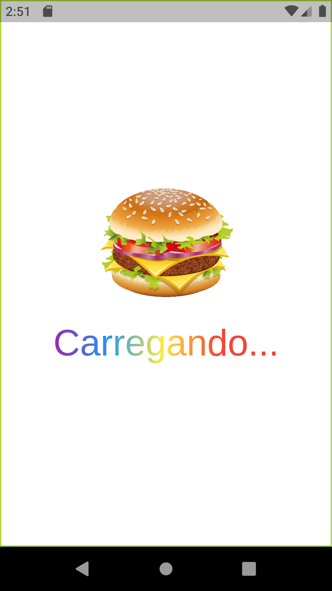
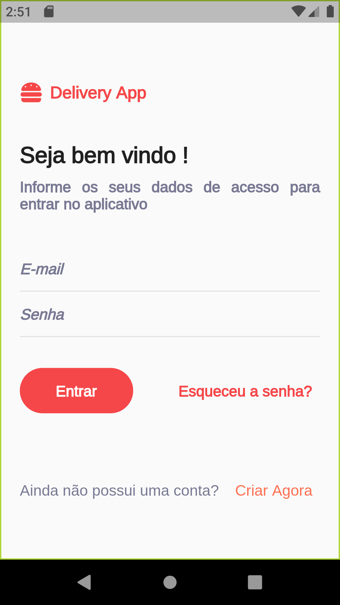
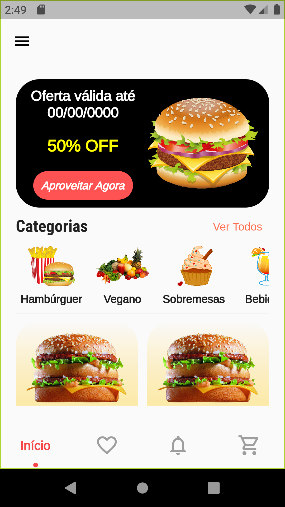
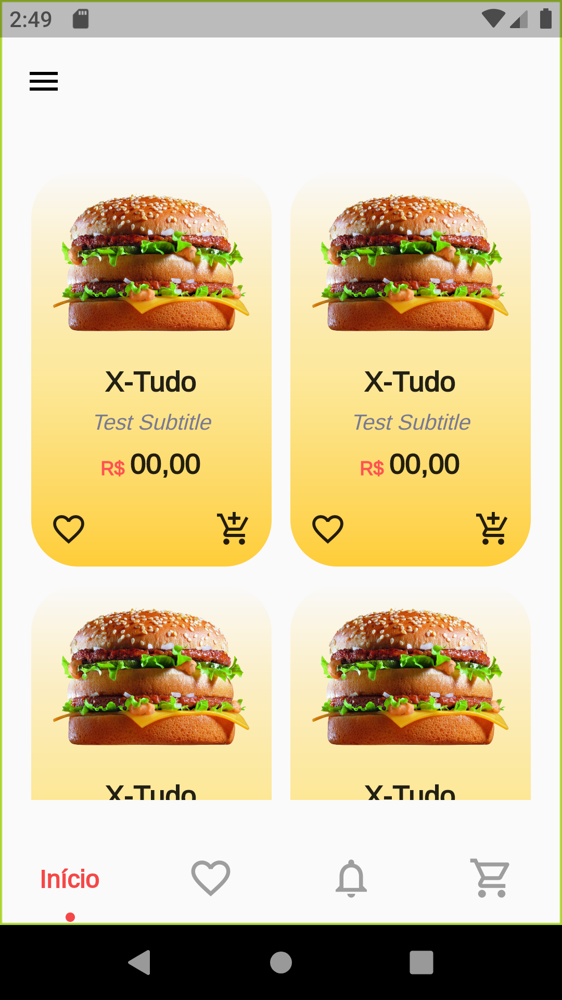
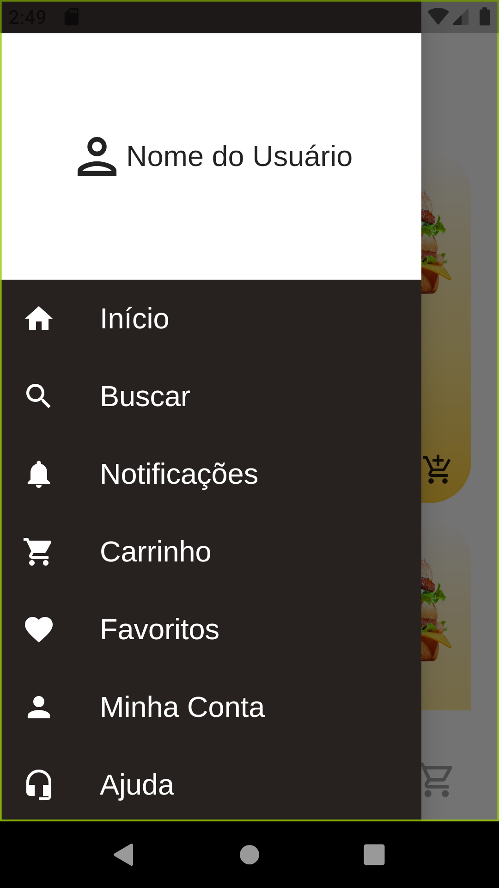
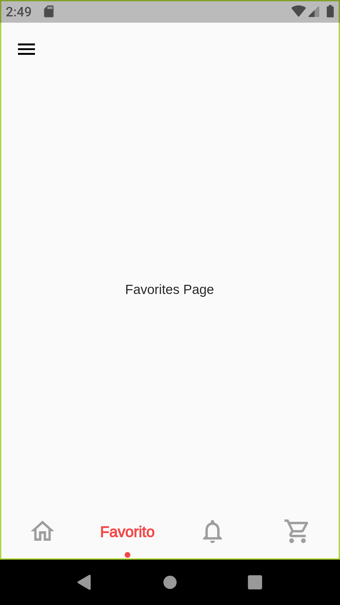
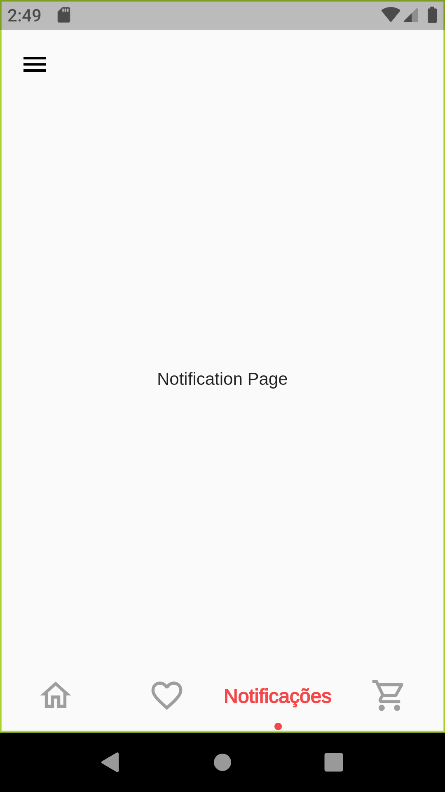
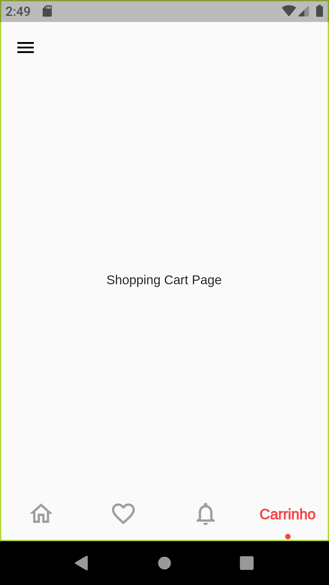
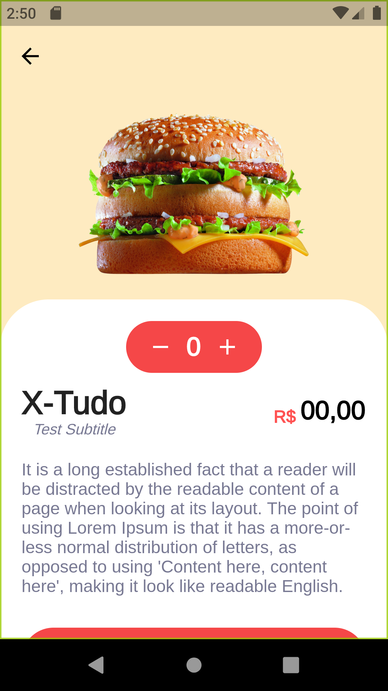
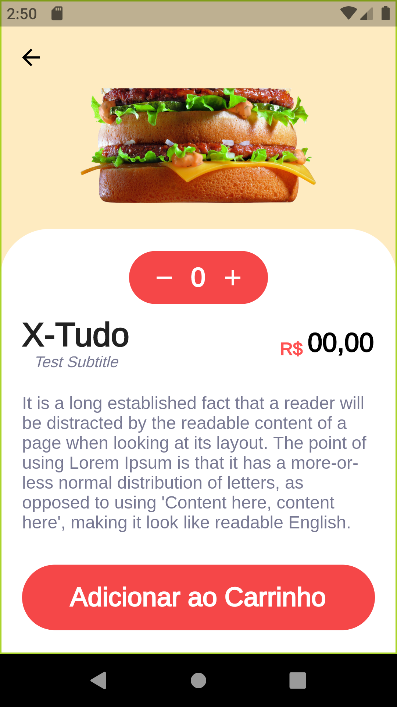

# Delivery Food App 

É um aplicativo mobile feito com Dart / Flutter com a finalidade de ser um "Delivery Food" ou um "Aplicativo de Entrega de Comidas". O aplicativo está em desenvolvimento e visa aprimorar os meus conhecimentos em relação à tecnologia utilizada. 

It is a mobile app made with Dart/Flutter for the purpose of food being a "Delivery Food" or a "Food Delivery App". The application is under development and aims to improve my knowledge of the technology used.

## Tela do Aplicativo | Application Screen

Você pode visualizar o vídeo do aplicativo funcionando em assets/Images_project/app.mp4

You can watch the video of the functioning aplication in assets/Images_project/app.mp4 

